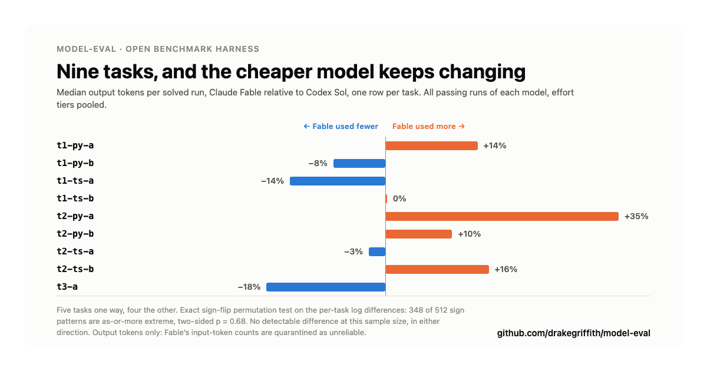

# model-eval: what happens when every model passes

Status: DRAFT, not published. Findings 2 and 3 were rewritten on 2026-08-03
after an earlier draft of this post got them wrong; see "A correction I made
to my own draft" at the end for what happened and why.

Every number below traces to `deliverables/STATS-CURRENT-2026-08-03.md`, which
is the verbatim output of the repo's own stats script (`python3
runner/stats.py`) over the live corpus: `runner/results/results.jsonl` (268
rows, 267 after exclusions), `runner/results/judgments.jsonl` (154 dual-judged
rows), `runner/results/transcripts/` (241 files). Section references like "§5"
point into that file. Nothing here is copied from the 2026-07-10 `ANALYSIS.md`
/ `STATS-APPENDIX.md` / `TABLES.md`, which cover an earlier, now-superseded
pass of the same harness.

Repo: github.com/drakegriffith/model-eval

---

## Why I built this

Every benchmark I could find for "is model A better than model B at coding"
gave me a leaderboard number and nothing to check it against. No transcript,
no grading rubric, no way to tell whether the task was actually hard or just
phrased to favor one vendor's house style. I wanted something I could point at
my own tasks, run against whatever CLI I already had subscription access to
(Claude Code, Codex), and get back not just a score but the receipts.

model-eval is that harness. It runs a model headlessly against a small,
verifiable coding task, scores the result with two independent LLM judges on
a shared rubric, and writes the transcript, the judgment, and the raw token
counts to the same repo the code lives in. Nothing about a run's outcome
depends on a number I typed in by hand afterward.

## How a run works

A task is a directory: a starting repo state with a real bug or a real
missing feature, a `verify.sh` that fails against the unpatched state and
passes against a reference fix, and a prompt handed to the model verbatim.
The model gets the repo and the prompt, runs headlessly to completion, and
`verify.sh` either passes or it doesn't. That's the only pass/fail signal
in the corpus — no judge ever overrides a failing test suite.

Two things back that up:

- **`selftest.sh` on every task.** Each task proves, offline, that its own
  `verify.sh` fails on the unpatched base and passes once the reference patch
  is applied. A task that doesn't wire up cleanly fails CI, not silently
  skipped.
- **Negative controls.** A subset of runs is an "empty" arm — the harness
  goes through the full prepare/verify/grade path with no fix applied at all,
  to confirm the grader reports a fail when nothing changed. Every negative
  control in the corpus reports `passed: false`. The grader isn't rubber-
  stamping.

Runs are unattended, which means `--dangerously-skip-permissions` /
`--dangerously-bypass-approvals-and-sandbox` on the CLI side. That's a real
reduction in the CLI's own safety net, so an OS-level `sandbox-exec` profile
and a process-level containment layer sit underneath every invocation
instead — deny-by-default on credential reads, writes contained to the run's
own scratch tree, API keys popped from the child's environment so every run
is subscription-authenticated, never key-authenticated. Full detail in the
README's security section.

Once a run finishes, two separate LLM judges (one Claude, one Codex) score
the diff independently on four dimensions — correctness, simplicity,
idiomatic style, spec adherence — without seeing each other's verdict.

## Finding 1: pass/fail stopped being the interesting number

Across the 267 scorable runs in the current corpus, every model passed every
task it attempted. 100%. Sol, Fable, Kimi K3, GPT-5.6 Luna, GPT-5.3 Codex
Spark, both Claude Haiku 4.5 snapshots, all of it. (There are 268 rows on
disk. One is excluded as a CLI error: the process died before the model got a
fair attempt, so its result was never earned either way. Exclusions are
printed with their counts at the top of the stats output rather than being
silently dropped.)

That's not a claim that these models are equivalent. It's a ceiling effect:
the task set (bug fixes and small feature additions in real repos, the kind
of thing t1/t2-tier tasks in this corpus cover) is easy enough for current
frontier and near-frontier models that pass/fail no longer separates them.
If I want a benchmark that still discriminates as models get better, either
the tasks get harder or I stop treating pass/fail as the metric that matters.
For this corpus, I did the second one: the real signal turned out to be cost
and judged quality, not whether the test suite went green.

## Finding 2: at matched tiers, the cost difference between the two big models is noise



With pass/fail saturated, cost is the obvious next axis. Comparing Claude's
Fable against Codex's Sol on the 9 tasks both models solved, taking each
model's median output tokens per solved run on each task (§5):

| task | Fable | Sol | Fable vs Sol |
|---|---|---|---|
| t1-py-a | 1,120 | 984 | +14% |
| t1-py-b | 1,074 | 1,164 | -8% |
| t1-ts-a | 994 | 1,162 | -14% |
| t1-ts-b | 1,719 | 1,719 | 0% |
| t2-py-a | 2,420 | 1,790 | +35% |
| t2-py-b | 2,862 | 2,599 | +10% |
| t2-ts-a | 3,210 | 3,293 | -3% |
| t2-ts-b | 2,679 | 2,318 | +16% |
| t3-a | 2,461 | 2,997 | -18% |

Five tasks lean one way, four lean the other, and the largest gap in the set
is 35%. Run the exact sign-flip permutation test over the per-task log
differences and 348 of the 512 possible sign patterns are as-or-more extreme
than the one observed: two-sided p = 0.68. There is no detectable cost
difference between these two models on this corpus, in either direction.

The careful phrasing is deliberate. "No detectable difference" is not "they
cost the same." Nine paired tasks is a coarse instrument: the smallest
two-sided p this test can even produce is 0.004, and that requires all nine
tasks pointing the same way. A five-four split lands where this one landed no
matter how large the underlying difference is. A real gap could be sitting
under this table, unresolvable at n=9. What I can say is that nothing in this
data supports choosing between these two models to save tokens.

Two scoping notes. First, the axis is **output tokens only**. Fable's
input-token counts are quarantined as unreliable on all 64 of its rows while
Sol's are measured on all 112, so a total-token contrast would put an
undercount against a true count and manufacture a gap out of a measurement
artifact. Second, that table pools every passing run of each model across the
effort tiers each was run at: Sol's pool spans `low` through `ultra`, Fable's
covers `medium` and `high`. Tier does move token spend, as Finding 3 shows,
so it's a model-level contrast and not a matched-tier one.

When I first drafted this section, the matched version wasn't in `stats.py`
and I wasn't going to quote a number for it off a spreadsheet I'd done by
hand. It's in the script now, as §6, and it earns its own paragraphs because
it doesn't just repeat §5.

Take a literally matched tier first: same effort label, both models, bare
runs only. At `medium`, Fable spends more on 5 of the 8 shared tasks, p =
0.43. At `high`, it spends less on 6 of 8, p = 0.086. Two tiers, opposite
signs, neither resolvable at n=8. The pooled answer survives the control.

The one contrast that does come back significant is the pair of cells §2 uses
for pass/fail: each model at its own winning effort. That's Fable at `medium`
against Sol at `low`, and there Fable spends more on 8 of 9 tasks, only 4 of
the 512 sign patterns are as-or-more extreme, p = 0.008. Read the cell names
before you read the p-value. Because effort never flipped an outcome (Finding
3), "winning effort" collapses to "cheapest tier this model was run at", so
this compares a medium-tier configuration against a low-tier one and some
unknown part of the gap is the tier rather than the model. It's also not a
symmetric matrix: Sol was run at five tiers starting at `low`, Fable at two
starting at `medium`. Fable's cheapest passing configuration here is `medium`
because `medium` is the floor of the run matrix, not because anything tested
a lower one.

So: no claim that either model is inherently cheaper survives the matched-tier
test, in either direction. What does survive is narrower and more useful. If
you're picking a configuration to deploy on work in this difficulty band, Sol
at `low` is the cheapest thing in this corpus that passes everything, and it
does it at roughly a 1.6x output-token advantage over Fable at `medium`
(geometric mean across the 9 shared tasks). Whether Fable at some lower tier
would close that gap is a run I haven't done.

## Finding 3: the effort knob never flipped a single outcome

Every model in this corpus exposes an "effort" knob (low/medium/high, or
similar), and the working assumption going in was that higher effort should
mean better outcomes. This is the one claim in the post where the corpus is
unambiguous, because it's a claim about matched pairs rather than an average.

§3 walks every adjacent pair of effort rungs, per model, matching runs by
task and repetition so task difficulty cancels out: Haiku 4.5 and its pinned
snapshot, Fable, Codex Spark, Luna, Kimi K3, and Sol's full five-rung ladder.
That's 15 comparisons over 144 matched pairs. Across all of them, the number
of discordant pairs, meaning a task that passed at one effort tier and failed
at the adjacent one, is **zero**. Not "rarely," not "not statistically
significant." Zero, everywhere, for every model. The same holds for the two
other paired contrasts in the file: Fable against Sol at their best tiers
(§2, 25 pairs) and bare against harnessed invocation (§4, 27 pairs). Nothing
in this corpus, turned in either direction, ever moved a run across the
pass/fail line.

What the knob did move is spend. Median output tokens per solved run, bare
invocation:

| model | low | medium | high | xhigh | max/ultra |
|---|---|---|---|---|---|
| Sol | 1,123 | 1,533 | 1,992 | 2,707 | 4,942 (ultra) |
| GPT-5.6 Luna | 1,551 | | 2,873 | | 5,249 (max) |
| GPT-5.3 Codex Spark | 2,308 | | 3,529 | 4,250 | |
| Kimi K3 | 1,384 | | 1,630 | | 1,971 (max) |
| Fable | | 1,737 | 2,008 | | |
| Claude Haiku 4.5 | 2,860 | | 2,674 | | 2,745 (max) |
| Claude Haiku 4.5 (pinned) | 5,227 | | 5,757 | | 4,840 (max) |

Sol's `ultra` costs about 4.4x its `low`, and Luna's `max` about 3.4x its
`low`, for zero additional passing runs. Kimi climbs gently. Both Haiku rows
are non-monotonic, and neither one has `low` as its cheapest tier, which is a
good reminder that the knob's name is a promise about intent and not a
guarantee about behavior. (These medians are descriptive, not a hypothesis
test. They use the same output-tokens-only axis as everything else here.)

The honest limit on this finding is the same ceiling effect from Finding 1.
Effort can't buy a pass on a task that already passes at the lowest tier.
What this corpus establishes is that on tasks in this difficulty band, the
knob is pure cost. Whether it earns its price on harder tasks is exactly the
question the corpus can't answer yet, and it's the strongest argument for
making the task set harder before running anything else.

## Judged quality: two judges, checked against each other

Pass/fail is binary and, on this corpus, saturated. The judges are where the
finer-grained signal lives — correctness, simplicity, idiomatic style, and
spec adherence, each scored 0-10 by two separately-prompted judges (Claude
and Codex) that never see each other's output.

Before trusting either judge's score, I checked whether they agree. Averaging
each judge's four dimension scores into one per-run number and comparing
those, the two judges land within a point of each other on 95.7% of the 139
runs both judges scored. Looking at the four dimensions individually instead
of the per-run average, agreement is tighter but still solid at 93.2% (518 of
556 judge-pairs within 1 point). Exact score matches are rarer (about 15% at
the per-run level) — the judges converge on the same rough quality tier far
more often than they converge on the exact same integer, which is what I'd
expect from two independently-prompted graders and not a sign that one of
them is noise.

With that agreement established, average judged scores (both judges, all
four dimensions) for the two models with enough judged runs to be worth
reading:

| model | correctness | simplicity | idiomatic | spec | n |
|---|---|---|---|---|---|
| Sol | 9.33 | 9.06 | 8.93 | 9.55 | 80 |
| Fable | 8.83 | 8.83 | 8.54 | 8.96 | 57 |

Sol scores slightly higher across all four dimensions in this corpus, by
about half a point on a 0-10 scale. Put next to Finding 2, that's the only
axis on which the two models separate at all here: identical pass rates, no
detectable cost difference at matched tiers, and a small judged-quality edge
to Sol. Half a point is also inside the judges' own mean disagreement with
each other (0.53 points, §7), so I'd treat it as a hint about where to look
next rather than a
result. It's a smaller and duller claim than "model X is better," and it's
the one this data actually carries.

## One data-quality note, in the open

Not every run's token count came from a clean, direct measurement. Of 268
runs, 148 have `tokens_in_status: measured` (read directly off the CLI's own
usage reporting), 56 are `recovered_in_ledger` (reconstructed from a
secondary usage log after the primary read was incomplete), and 64 are
`quarantined`, flagged as unreliable. The quarantine is not scattered
randomly: it's all 64 of Fable's rows, every one of them, while all 112 of
Sol's are measured. There is no trustworthy input-token number for Fable
anywhere in this corpus.

That's why every token figure in this post is output tokens only. It's a
known rough edge in how different CLIs report usage over long headless
sessions, not a hidden one, and the field exists specifically so a bad read
fails loud in the data rather than quietly averaging into a number that looks
trustworthy. The next section is what happens when you ignore it.

## A correction I made to my own draft

The first version of this post led with a much better headline: same pass
rate, about a fifth of the tokens, p = 0.004. Sol used more tokens than Fable
on all 9 of 9 matched tasks. It was a great chart. It was also wrong, and it
was wrong in the specific way this whole project exists to catch.

I had computed cost as `tokens_in + tokens_out`, which is the obvious
definition and the wrong one here, because Fable's `tokens_in` is quarantined
on 100% of its rows. I was comparing Fable's undercounted total against Sol's
complete one and reading the measurement gap as a performance gap. Worse, the
repo's own stats script had already been corrected for exactly this reason
days earlier, on 2026-07-30, and states the output-tokens-only rule in a
comment. I didn't run it. I recomputed the numbers by hand instead, and my
hand-rolled version quietly reintroduced the bug the script had been fixed to
prevent.

Run the script and the flagship finding evaporates: p = 0.68, direction
mixed, nothing detectable. That's Finding 2 above.

I'm leaving this in the post rather than quietly fixing the numbers, for two
reasons. The first is that a benchmark asking you to trust its methodology
should show you the time its methodology caught the author. The second is
that the failure mode generalizes past me: a number that is 4.8x and p =
0.004 and confirms something you already half-believed is exactly the number
that doesn't get a second look. The wrong chart is still in the repo under
`assets/model-eval-token-chart-WRONG-DO-NOT-USE.png`, and it looks completely
convincing, which is the point.

## Try it

No UI, no signup, no API key required for the smoke test:

```
git clone https://github.com/drakegriffith/model-eval
cd model-eval
bash tasks/t1-py-a/selftest.sh          # offline: proves the task is real by
                                          # showing verify.sh fail, then pass,
                                          # once the reference fix is applied
python3 runner/run.py --mock --limit 1  # exercises the full harness pipeline,
                                          # no tokens spent, no API key needed
```

Point `runner/run.py` at your own Claude Code or Codex CLI (subscription
auth, no key needed) to run a live model against a task and see how it does.
`CONTRIBUTING.md` covers adding a new task or a new model to the registry.

Repo: https://github.com/drakegriffith/model-eval
